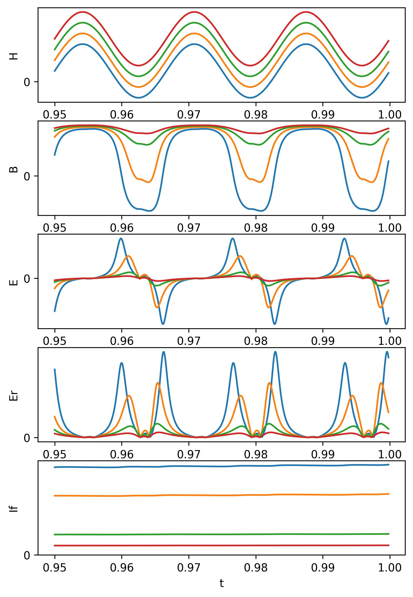

# TX-sim
## 可飽和変流器
### 磁気ヒステリシスモデル
Jiles–Atherton モデルを採用。 $\tanh$ 関数でも可。

$$
\begin{aligned}
    M&=cM_{an}+(1-c)M_{irr}\\
    M_{an}&=
    M_s\left[
        \cosh \left(\frac{H+\alpha M}{a}\right)-\frac{a}{H+\alpha M}
    \right]\\
    \frac{dM_{irr}}{dH}&=
    \frac{M_{an}-M_{irr}}{k\delta-\alpha (M_{an}-M_{irr})}\\
    \delta&=
    \begin{cases}
    +1, \frac{dH}{dt}>0\\
    -1, \frac{dH}{dt}<0
    \end{cases}\\
    B(H)&=\mu_0M(H)\\
\end{aligned}
$$

### 励磁回路
$$
\text{Faraday's law: }\oint_{\partial \Sigma}\mathbf{E}\cdot d\mathbf{\ell}=-\iint_\Sigma \frac{\partial \mathbf{B}}{\partial t}\cdot d\mathbf{S}
$$

$$
\mathcal{E}=-N_2\frac{d\Phi}{dt}\approxeq -N_2\frac{d}{dt}(BS)
$$

$$
E_r=
\begin{cases}
    |\mathcal{E}|-v_d & \text{if }|\mathcal{E}|-v_d>0\\
    0 & \text{otherwise}
\end{cases}
\approx |\mathcal{E}| \quad \because v_d\ll |\mathcal{E}|
$$

$$
\sum_\text{loop}V_i=0\quad\to\quad E_r=R_f+L_f\frac{dI_f}{dt}
$$

### 結果

